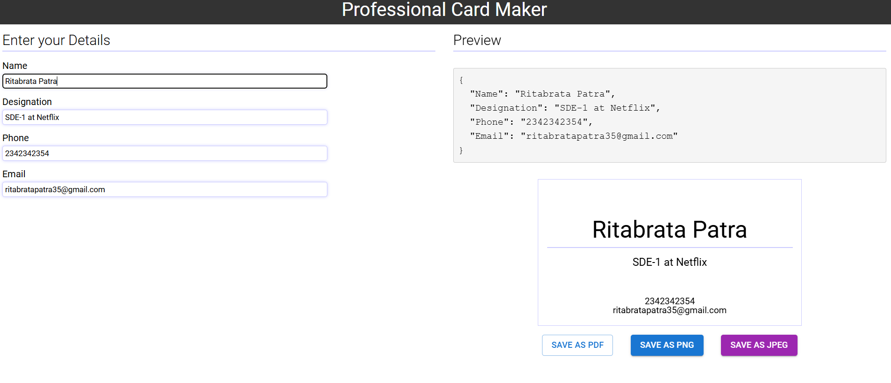

# Business Card Generator

A feature-rich **React.js** application to design and generate professional business cards. This app enables users to customize their business card details, preview the design in real time, and download the final output in multiple formats, including **PDF**, **PNG**, and **JPEG**.



## Table of Contents

- [Features](#features)
- [Demo](#demo)
- [Installation](#installation)
- [Usage](#usage)
- [Tech Stack](#tech-stack)
- [Folder Structure](#folder-structure)
- [Contributing](#contributing)
- [License](#license)

## Features

- **Real-Time Preview**: View your business card as you input your details.
- **Download in Multiple Formats**: Export your business card as a **PDF**, **PNG**, or **JPEG** file.
- **Customizable Fields**: Include your name, title, company name, contact information, and more.
- **Responsive Design**: Fully responsive to ensure your business card looks great on all devices.

## Demo

Check out a live demo of the app here:  
[Live Demo](https://bussiness-card-maker.vercel.app/)  

## Installation

Follow the steps below to get the Business Card Generator up and running on your local machine:

### Prerequisites

Make sure you have **Node.js** and **npm** (Node Package Manager) installed on your machine.

You can check if they're installed by running the following commands in your terminal:

```bash
node -v
npm -v

```

## Steps

1. **Clone the repository** to your local machine:
   ```bash
   git clone https://github.com/your-username/business-card-generator.git
    ```

2. Navigate to the project directory:
   ```bash
    cd business-card-generator


3. Install the dependencies using npm:
   ```bash
    npm install


4. Start the development server:
 ```bash
    npm start

5. Open the app by going to http://localhost:3000.
